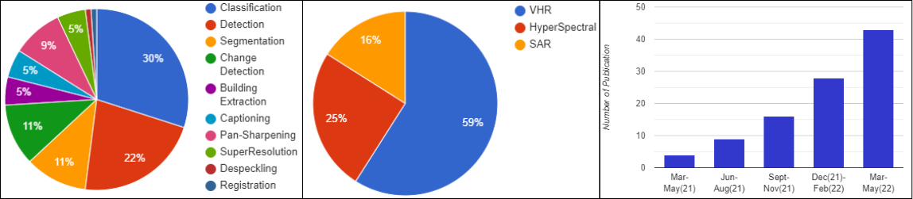

# Transformer-in-Remote-Sensing:A-Survey
# This repo supplements our [Transformer for Remote Sensing Survey](https://arxiv.org/abs/2209.01206)
Abdulaziz Amer Aleissaee*, Amandeep Kumar*, Rao Muhammad Anwer,  Salman Khan, Hisham Cholakkal, Fahad Shahbaz khan

This repo includes the Remote Sensing papers with Transformers which are presented in our [paper](https://arxiv.org/abs/2209.01206), and we aim to frequently update the latest relevant papers.

#### Content
- [VHR Imagery](#vhr-imagery) 
  - [Image Classification](#image-classification-vhr) 
  - [Image Detection](#image-Detection-vhr) 
  - [Change Detection](#Change-Detection-vhr) 
  - [Image Segmentation](#Image-Segmentation-vhr) 
  - [Building Extraction](#Building-Extraction-vhr) 
  - [Image Captioning](#Image-Captioning-vhr) 
  - [Image Super Resolution](#Image-Super-Resolution-vhr) 
- [Hyperspectral Imagery](#hyperspectral-imagery) 
  - [Image Classification](#image-classification-hyper) 
  - [Pan Sharpening](#pan-sharpening) 
- [SAR Imagery](#sar-imagery) 
  - [Image Classification](#image-classification-sar) 
  - [Image Detection](#image-Detection-sar) 
  - [Despeckling](#despeckling-sar) 
  - [Registration](#registration-sar) 
  - [Change Detection](#Change-Detection-sar) 
  - [SAR Image Interpretation](#Image-interpretation-sar) 
  - [Others](#Others-sar) 
  
  ## VHR Imagery
  ### Image Classification
  
  Vision transformers for remote sensing image classification [[PDF](https://www.mdpi.com/2072-4292/13/3/516)] 
  
  TRS: Transformers for Remote Sensing Scene Classification [[PDF](https://www.mdpi.com/2072-4292/13/20/4143)] 
  
  Two-stream swin transformer with differentiable sobel operator for remote sensing image classification[[PDF](https://www.mdpi.com/2072-4292/14/6/1507)] 
  
  When cnns meet vision trans-former: A joint framework for remote sensing scene classification, [[PDF](https://ieeexplore.ieee.org/document/9531646)] 
  
  Homo– heterogenous transformer learning framework for rs scene classification [[PDF](https://ieeexplore.ieee.org/document/9726930)] 
  
  An Empirical Study of Remote Sensing Pretraining [[PDF](https://arxiv.org/pdf/2204.02825.pdf)] 
  
  ### Image Detection 
  
  An improved swin transformer-based model for remote sensing object detection and instance segmentation [[PDF](https://www.mdpi.com/2072-4292/13/23/4779)] 
  
  Transformer with transfer cnn for remote-sensing-image object detection [[PDF](https://www.mdpi.com/2072-4292/14/4/984)] 
  
  Gansformer: A detection network for aerial images with high performance com- bining convolutional network and transformer[[PDF](https://www.google.com/url?sa=t&rct=j&q=&esrc=s&source=web&cd=&ved=2ahUKEwj-l-rvmdz5AhVPgFwKHbB2BmkQFnoECAMQAQ&url=https%3A%2F%2Fwww.mdpi.com%2F2072-4292%2F14%2F4%2F923%2Fpdf-vor&usg=AOvVaw2yZ1gWqccUj6ryT8rkQSDk)] 
  
  Adt-det: Adaptive dynamic refined single-stage transformer detector for arbitrary- oriented object detection in satellite optical imagery, [[PDF](https://www.mdpi.com/2072-4292/13/13/2623)] 
  
  Point rcnn: An angle-free framework for rotated object detection [[PDF](https://arxiv.org/pdf/2205.14328.pdf)] 
  
  Hybrid network model: Transconvnet for oriented object detection in remote sensing images [[PDF](https://www.mdpi.com/2072-4292/14/9/2090)] 
  
  Oriented reppoints for aerial object detection [[PDF](https://arxiv.org/pdf/2105.11111.pdf)] 
  
  Oriented object detection with transformer [[PDF](https://arxiv.org/pdf/2106.03146.pdf)] 
  
  Ao2-detr: Arbitrary-oriented object detection transformer [[PDF](https://arxiv.org/pdf/2205.12785.pdf)] 
  
  Few could be better than all: Feature sampling and grouping for scene text detection, [[PDF](https://arxiv.org/pdf/2203.15221.pdf)] 
  
  Rodformer: High- precision design for rotating object detection with transformers, [[PDF](https://www.google.com/url?sa=t&rct=j&q=&esrc=s&source=web&cd=&cad=rja&uact=8&ved=2ahUKEwiCyMbFm9z5AhUDXRoKHQp7A7MQFnoECAQQAQ&url=https%3A%2F%2Fwww.mdpi.com%2F1424-8220%2F22%2F7%2F2633%2Fpdf&usg=AOvVaw3DLIqXn7a183wAYDE7NFn_)] 
  
  ### Change Detection 
  

  Remote sensing image change detection with transformers [[PDF](https://arxiv.org/pdf/2103.00208.pdf)] 
  
  Deep multiscale siamese network with parallel convolutional structure and self-attention for change detection [[PDF](https://ieeexplore.ieee.org/document/9632564)] 
  
  Swinsunet: Pure transformer network for remote sensing image change detection [[PDF](https://ieeexplore.ieee.org/document/9736956)] 
  
  A network combining a transformer and a convolutional neural network for remote sensing image change detection, [[PDF](https://www.mdpi.com/2072-4292/14/9/2228)] 
  
  A hybrid transformer network for change detection in optical remote-sensing images [[PDF](https://ieeexplore.ieee.org/document/9761892)] 
  
  Hybrid-transcd: A hybrid transformer remote sensing image change detection network via token aggregation [[PDF](https://www.mdpi.com/2220-9964/11/4/263)] 
  
  ### Image Segmentation
  
  Stransfuse: Fusing swin transformer and convolutional neural network for remote sensing image semantic segmentation [[PDF](https://ieeexplore.ieee.org/document/9573374)] 
  
  Cctnet: Coupled cnn and transformer network for crop segmentation of remote sensing images, [[PDF](https://www.mdpi.com/2072-4292/14/9/1956)] 
  
  Transformer and cnn hybrid deep neural network for semantic segmentation of very-high-resolution remote sensing imagery [[PDF](https://ieeexplore.ieee.org/document/9686732)] 
  
  Transformer-based decoder designs for semantic segmentation on remotely sensed images [[PDF](https://www.mdpi.com/2072-4292/13/24/5100)] 
  
  Efficient transformer for remote sensing image segmentation [[PDF](https://www.mdpi.com/2072-4292/13/18/3585)] 
  
  ### Building Extraction
  
  Building extraction from remote sensing images with sparse token transformers, [[PDF](https://www.mdpi.com/2072-4292/13/21/4441/htm)] 
  
  A swin transformer-based encoding booster integrated in u-shaped network for building extraction [[PDF](https://www.mdpi.com/2072-4292/14/11/2611)] 
  
  Building extraction with vision transformer [[PDF](https://arxiv.org/pdf/2111.15637.pdf)] 
  
  Transferring transformer-based models for cross-area building extraction from remote sensing images [[PDF](https://ieeexplore.ieee.org/document/9775207)] 
  
  ### Image Captioning
  
  Remote sensing image caption generation via transformer and reinforcement learning, [[PDF](https://link.springer.com/article/10.1007/s11042-020-09294-7)] 
  
  Remote-sensing image captioning based on multilayer aggregated transformer [[PDF](https://ieeexplore.ieee.org/document/9709791)] 
  
  A mask-guided transformer network with topic token for remote sensing image captioning [[PDF](https://www.mdpi.com/2072-4292/14/12/2939/htm)] 
  
  ### Image Super Resolution 
  
  Tr-misr: Multiimage super-resolution based on feature fusion with transformers, [[PDF](https://ieeexplore.ieee.org/document/9684717)] 
  
  Transformer-based multistage enhancement for remote sensing image super-resolution [[PDF](https://ieeexplore.ieee.org/document/9654169)] 
  
  A super- resolution method of remote sensing image using transformers [[PDF](https://ieeexplore.ieee.org/document/9660904)] 
  
  Space-time Super-resolution for Satellite Video: A Joint Framework Based on Multi-Scale Spatial-Temporal Transformer [[PDF]  (https://www.sciencedirect.com/science/article/pii/S0303243422000575)] 
  
  ## Hyperspectral Imagery
  
  ### Image Classification
  
  Spectralformer: Rethinking hyperspectral image classification with transformers[[PDF](https://arxiv.org/pdf/2107.02988.pdf)] 
  
  Multiscale convolutional transformer with center mask pretraining for hyperspectral image classification [[PDF](https://arxiv.org/pdf/2203.04771.pdf)] 
  
  Multimodal fusion transformer for remote sensing image classification [[PDF](https://arxiv.org/pdf/2203.16952.pdf)] 
  
  Convolutional transformer network for hyperspectral image classification, [[PDF](https://ieeexplore.ieee.org/document/9762303)] 
  
  Deep hierarchical vision transformer for hyperspectral and lidar data classification [[PDF](https://ieeexplore.ieee.org/document/9755059)] 
  
  Dss-trm: deep spatial–spectral transformer for hyperspectral image classification [[PDF](https://www.tandfonline.com/doi/full/10.1080/22797254.2021.2023910)] 
  
  Hyperspectral image trans- former classification networks [[PDF](https://ieeexplore.ieee.org/document/9766028)] 
  
  Hsi-bert: Hyperspectral image classification using the bidirectional en- coder representation from transformers [[PDF](https://ieeexplore.ieee.org/document/8824217)] 
  
  Spectral–spatial feature tokenization transformer for hyperspectral image classification [[PDF](https://ieeexplore.ieee.org/document/9684381)] 
  
  Spectral-spatial transformer network for hyperspectral image classification: A factorized architecture search framework, [[PDF](https://ieeexplore.ieee.org/document/9565208)]   
  
  ### Pan-Sharpening
  
  PanFormer: a Transformer Based Model for Pan-sharpening [[PDF](https://arxiv.org/pdf/2203.02916.pdf)] 
  
  Hypertransformer: A textural and spectral feature fusion transformer for pansharpening [[PDF](https://arxiv.org/pdf/2203.02503.pdf)] 
  
  Pmacnet: Parallel multiscale attention constraint network for pan-sharpening [[PDF](https://ieeexplore.ieee.org/document/9764690)] 
  
  Pan-sharpening based on cnn+ pyramid transformer by using no-reference loss, [[PDF](https://www.mdpi.com/2072-4292/14/3/624)] 
  
  Multiscale spatial–spectral interaction transformer for pan-sharpening [[PDF](https://www.mdpi.com/2072-4292/14/7/1736)] 
  
  Transformer-based regression network for pansharpening remote sensing images [[PDF](https://ieeexplore.ieee.org/document/9715116)] 
  
  ## SAR Imagery
  
  ### Image Classification
  
  Exploring vision transformers for polarimetric sar image classification [[PDF](https://ieeexplore.ieee.org/document/9658539)] 
  
  High resolution sar image classification using global-local network structure based on vision transformer and cnn [[PDF](https://ieeexplore.ieee.org/document/9713848)] 
  
  St-pn: A spatial transformed prototypical network for few-shot sar image classification [[PDF](https://www.mdpi.com/2072-4292/14/9/2019)] 
  
  
  ### Segmentation 
  
  Gcbanet: A global context boundary-aware network for sar ship instance segmentation[[PDF](https://www.mdpi.com/2072-4292/14/9/2165)] 
  
  ### Image Detection
  
  Crtranssar: A visual transformer based on contextual joint representation learning for sar ship detection [[PDF](https://www.mdpi.com/2072-4292/14/6/1488)] 
  
  Geospatial transformer is what you need for aircraft detection in sar imagery [[PDF](https://ieeexplore.ieee.org/document/9741706)] 
  
  Sfre-net: Scattering feature relation enhancement network for aircraft detection in sar images [[PDF](https://www.mdpi.com/2072-4292/14/9/2076)] 
  
  End-to-end method with transformer for 3d detection of oil tank from single sar image, [[PDF](https://ieeexplore.ieee.org/document/9614654)] 
  
  ### Despeckling
  
  Transformer based sar image despeckling [[PDF](https://arxiv.org/pdf/2201.09355.pdf)] 
  
  ### Change Detection
  
  A contrastive learning transformer for change detection in highresolution sar images [[PDF](https://papers.ssrn.com/sol3/papers.cfm?abstract_id=4169439)] 
  
  ### Image Registration
  
  A transformer-based coarse-tofine wide-swath sar image registration method under weak texture conditions [[PDF](https://www.mdpi.com/2072-4292/14/5/1175)] 
  
  
  
  
  
  
  
  
  
  
  
  
  
  
  
  
  
  
  

